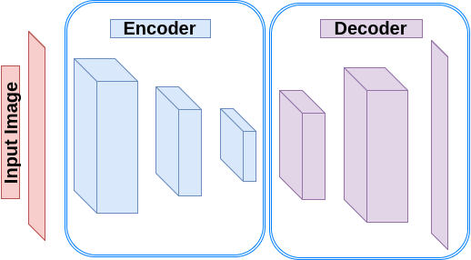

Autoencoders and their implementations in TensorFlow
----------------------------------------------------

In this post, you will learn the concept behind Autoencoders as well how
to implement an autoencoder in TensorFlow.

Introduction
------------

Autoencoders are a type of neural networks which copy its input to its
output. They usually consist of two main parts, namely Encoder and
Decoder. The encoder map the input into a hidden layer space which we
refer to as a code. The decoder then reconstructs the input from the
code. There are different types of Autoencoders:

-   **Undercomplete Autoencoders:** An autoencoder whose code
    dimension is less than the input dimension. Learning such an
    autoencoder forces it to capture the most salient features.
    However, using a big encoder and decoder in the lack of enough
    training data allows the network to memorized the task and omits
    learning useful features. In case of having linear decoder, it can
    act as PCA. However, adding nonlinear activation functions to the
    network makes it a nonlinear generalization of PCA.
-   **Regularized Autoencoders:** Rather than limiting the size of
    autoencoder and the code dimension for the sake of feature
    learning, we can add a loss function to prevent it memorizing the
    task and the training data.
     -   **Sparse Autoencoders:** An autoencoder which has a sparsity
         penalty in the training loss in addition to the
         reconstruction error. They usually being used for the
         porpuse of other tasks such as classification. The loss is
         not as straightforward as other regularizers, and we will
         discuss it in another post later.
     -   **Denoising Autoencoders (DAE):** The input of a DAE is a
         corrupted copy of the real input which is supposed to be
         reconstructed. Therefore, a DAE has to undo the corruption
         (noise) as well as reconstruction.
     -   **Contractive Autoencoders (CAE):** The main idea behind
         these type of autoencoders is to learn a representation of
         the data which is robust to small changes in the input.
-   **Variational Autoencoders:** They maximize the probability of the
    training data instead of copying the input to the output and
    therefore does not need regularization to capture useful
    information.

In this post, we are going to create a simple Undercomplete Autoencoder
in TensorFlow to learn a low dimension representation (code) of the
MNIST dataset.

Create an Undercomplete Autoencoder
-----------------------------------

We are going to create an autoencoder with a 3-layer encoder and 3-layer
decoder. Each layer of encoder downsamples its input along the spatial
dimensions (width, height) by a factor of two using a stride 2.
Consequently, the dimension of the code is 2(width) X 2(height) X
8(depth) = 32 (for an image of 32X32). Similarly, each layer of the
decoder upsamples its input by a factor of two (using transpose
convolution with stride 2).

.. code-block:: python

    import tensorflow.contrib.layers as lays

    def autoencoder(inputs):
        # encoder
        # 32 file code blockx 32 x 1   ->  16 x 16 x 32
        # 16 x 16 x 32  ->  8 x 8 x 16
        # 8 x 8 x 16    ->  2 x 2 x 8
        net = lays.conv2d(inputs, 32, [5, 5], stride=2, padding='SAME')
        net = lays.conv2d(net, 16, [5, 5], stride=2, padding='SAME')
        net = lays.conv2d(net, 8, [5, 5], stride=4, padding='SAME')
        # decoder
        # 2 x 2 x 8    ->  8 x 8 x 16
        # 8 x 8 x 16   ->  16 x 16 x 32
        # 16 x 16 x 32  ->  32 x 32 x 1
        net = lays.conv2d_transpose(net, 16, [5, 5], stride=4, padding='SAME')
        net = lays.conv2d_transpose(net, 32, [5, 5], stride=2, padding='SAME')
        net = lays.conv2d_transpose(net, 1, [5, 5], stride=2, padding='SAME', activation_fn=tf.nn.tanh)
        return net

   **Figure 1:** Autoencoder

The MNIST dataset contains vectorized images of 28X28. Therefore we
define a new function to reshape each batch of MNIST images to 28X28 and
then resize to 32X32. The reason of resizing to 32X32 is to make it a
power of two and therefore we can easily use the stride of 2 for
downsampling and upsampling.

.. code-block:: python

    import numpy as np
    from skimage import transform

    def resize_batch(imgs):
        # A function to resize a batch of MNIST images to (32, 32)
        # Args:
        #   imgs: a numpy array of size [batch_size, 28 X 28].
        # Returns:
        #   a numpy array of size [batch_size, 32, 32].
        imgs = imgs.reshape((-1, 28, 28, 1))
        resized_imgs = np.zeros((imgs.shape[0], 32, 32, 1))
        for i in range(imgs.shape[0]):
            resized_imgs[i, ..., 0] = transform.resize(imgs[i, ..., 0], (32, 32))
        return resized_imgs

Now we create an autoencoder, define a square error loss and an
optimizer.

.. code-block:: python

    import tensorflow as tf

    ae_inputs = tf.placeholder(tf.float32, (None, 32, 32, 1))  # input to the network (MNIST images)
    ae_outputs = autoencoder(ae_inputs)  # create the Autoencoder network

    # calculate the loss and optimize the network
    loss = tf.reduce_mean(tf.square(ae_outputs - ae_inputs))  # claculate the mean square error loss
    train_op = tf.train.AdamOptimizer(learning_rate=lr).minimize(loss)

    # initialize the network
    init = tf.global_variables_initializer()

Now we can read the batches, train the network and finally test the
network by reconstructing a batch of test images.

.. code-block:: python

    from tensorflow.examples.tutorials.mnist import input_data

    batch_size = 500  # Number of samples in each batch
    epoch_num = 5     # Number of epochs to train the network
    lr = 0.001        # Learning rate

    # read MNIST dataset
    mnist = input_data.read_data_sets("MNIST_data", one_hot=True)

    # calculate the number of batches per epoch
    batch_per_ep = mnist.train.num_examples // batch_size

    with tf.Session() as sess:
        sess.run(init)
        for ep in range(epoch_num):  # epochs loop
            for batch_n in range(batch_per_ep):  # batches loop
                batch_img, batch_label = mnist.train.next_batch(batch_size)  # read a batch
                batch_img = batch_img.reshape((-1, 28, 28, 1))               # reshape each sample to an (28, 28) image
                batch_img = resize_batch(batch_img)                          # reshape the images to (32, 32)
                _, c = sess.run([train_op, loss], feed_dict={ae_inputs: batch_img})
                print('Epoch: {} - cost= {:.5f}'.format((ep + 1), c))

        # test the trained network
        batch_img, batch_label = mnist.test.next_batch(50)
        batch_img = resize_batch(batch_img)
        recon_img = sess.run([ae_outputs], feed_dict={ae_inputs: batch_img})[0]

        # plot the reconstructed images and their ground truths (inputs)
        plt.figure(1)
        plt.title('Reconstructed Images')
        for i in range(50):
            plt.subplot(5, 10, i+1)
            plt.imshow(recon_img[i, ..., 0], cmap='gray')
        plt.figure(2)
        plt.title('Input Images')
        for i in range(50):
            plt.subplot(5, 10, i+1)
            plt.imshow(batch_img[i, ..., 0], cmap='gray')
        plt.show()
